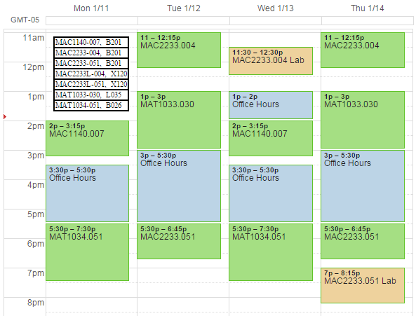

2016 Spring (Winter)
====================
 
Vic Brennan  
office: B207D  
email: victor.brennan@sfcollege.edu

---

Course First-Day Handouts
-------------------------

* MAT1033.030
* MAT1034.051
* MAC1140.007
* MAC2233.004
* MAC2233.051

Final Exams
-----------

----------------------------------------------------------------
 	         Monday       Tuesday      Wednesday    Thursday
 	         4/25	      4/26	       4/27         4/28
------------ ------------ ------------ ------------ ------------
10:30-12:30  			  	                        MAC2233.004
             			  	                        B201

3:30-5:30	 MAC1140.007 	                       
             B201        	                       

5:45-7:45	 MAC2233.051 	                       
             B206        	                       
----------------------------------------------------------------

Resources
---------

I strongly encourage you to take advantage of office hours. Other resources include:

* The Math Department has several resources for students including two labs:
    + The Math Studio in P220 is primarily for MyMathLab courses but is a resource for all math students.
    + The Math Lab in G014 is a very nice resource for getting one-on-one help with math.
* Smarthinking is accessible through eSantaFe and provides 24/7 live tutoring on any class taught at Santa Fe.
* Student Support Services has help available for qualified students.
